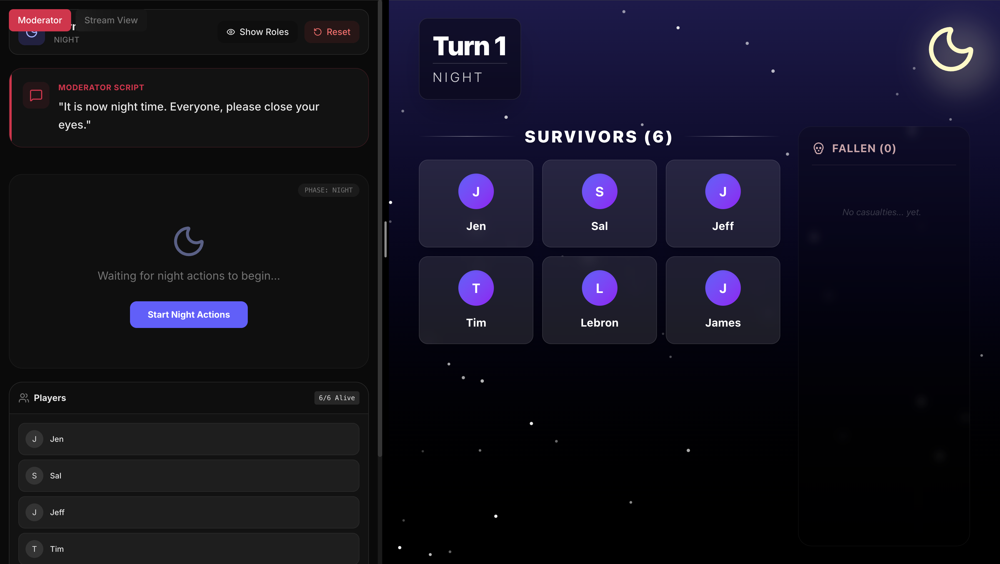
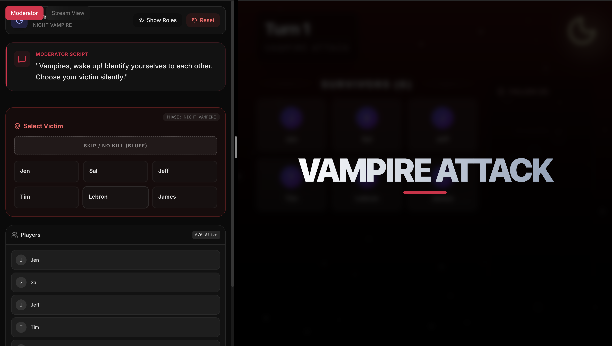
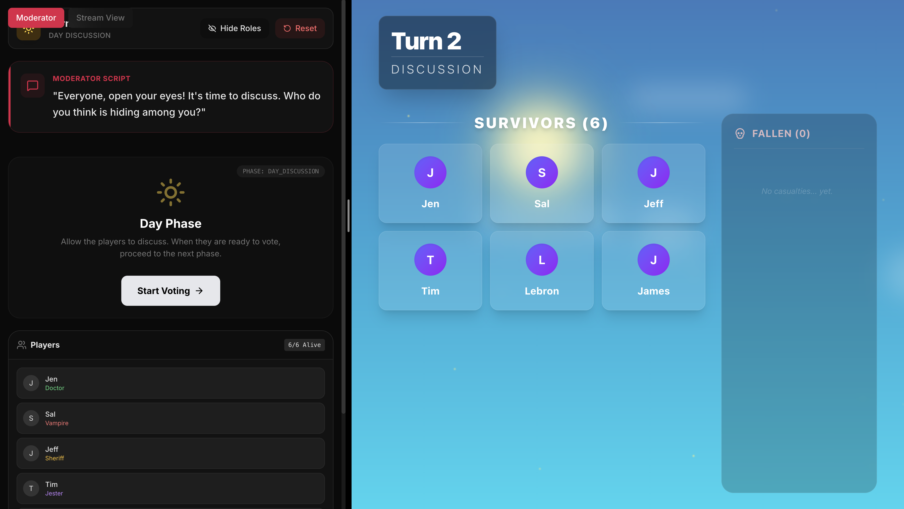
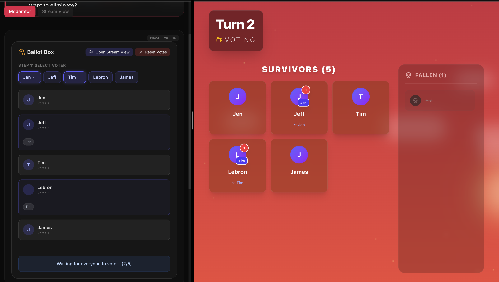
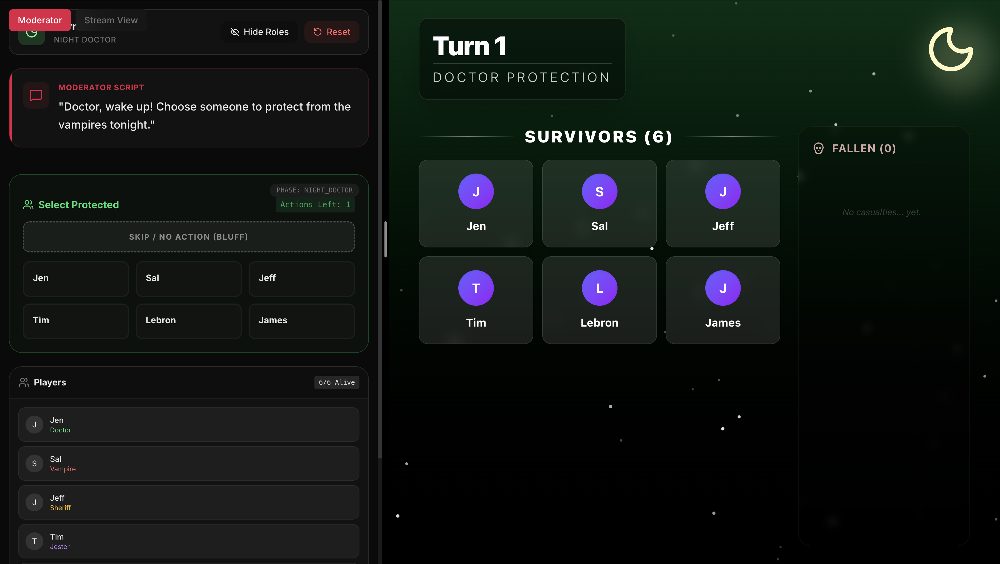
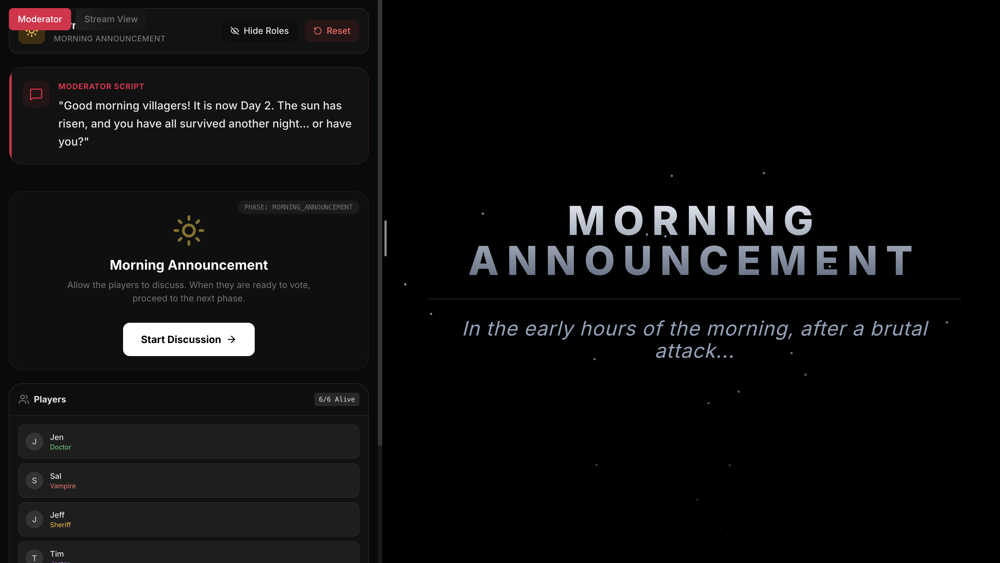
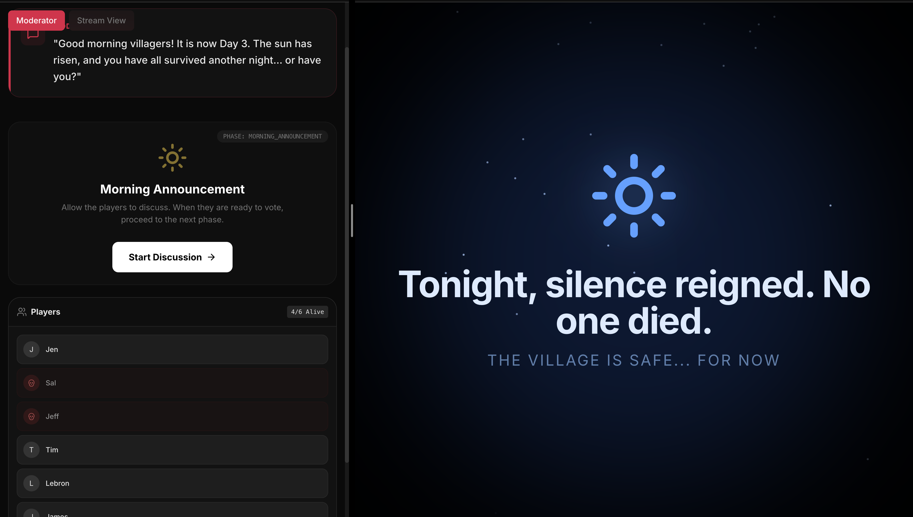

# 🧛 Vampire Villager (Vampir Köylü)

A modern, feature-rich web application for hosting the classic social deduction game "Werewolf" (Vampire Villager). Built specifically for **streamers** and **online communities** with a dedicated **Moderator Dashboard** and beautiful **Stream View** for viewers.



## 🎯 Why This Exists

This project was created to solve a common problem for streamers and online communities: **how to effectively moderate and broadcast social deduction games**. Traditional werewolf games require physical cards and in-person gameplay, making them difficult to stream. This application provides:

- **Professional Stream Integration**: A clean, viewer-friendly interface that updates in real-time
- **Easy Moderation**: Dedicated tools to manage roles, phases, and game flow without revealing secrets
- **Flexible Deployment**: Can be run locally or deployed online via GitHub Pages
- **Bilingual Support**: Full Turkish and English support for international audiences
- **No Physical Components**: Everything is managed digitally, perfect for remote play

Perfect for Discord communities, Twitch/YouTube streamers, or any group wanting to play remotely!

## 📸 Visual Gameplay Guide

The game is designed with a **Dual-View System**:
- **Left Side (Stream View)**: What your viewers see. Safe, cinematic, and spoiler-free.
- **Right Side (Moderator Dashboard)**: What you see. Full control, role info, and game management.

### 1. Lobby & Setup
Moderator adds players and configures the game balance. The stream view shows a waiting lobby.


### 2. Role Distribution
Roles are assigned randomly. The stream view shows a dramatic "Assigning Roles" animation while the moderator sees the actual roles.


### 3. Night Phase 🌑
The village sleeps. The moderator manages night actions (Vampire kills, Doctor saves, Sheriff investigations) while the stream view shows a thematic night ambience.


### 4. Morning Reveal 🌅
The sun rises! The stream view dramatically reveals if anyone died or if the village is safe.


### 5. Day Discussion ☀️
Players discuss who to vote out. The stream view shows a sun tracking the discussion time.


### 6. Voting Phase 🗳️
Players cast their votes. The stream view updates in real-time as the moderator inputs votes.


### 7. Victory! 🏆
When one team wins, a victory screen is displayed for everyone.


## ✨ Key Features

### 🎮 Dual-View System
- **Moderator Dashboard**: Private control panel to manage the entire game
  - Role assignments and tracking
  - Phase progression controls
  - Night action management
  - Voting system with live tallying
- **Stream View** (`/stream` route): Clean, public-facing display for viewers
  - Shows living players and eliminated players (graveyard)
  - Phase announcements with dramatic animations
  - Vote count visualization
  - No role spoilers (safe for stream overlays)

### 🎭 Complete Role System
- **Villagers** 🧑‍🌾: Innocent citizens trying to survive
- **Vampires** 🧛: Kill at night, deceive during the day
- **Doctor** 👨‍⚕️: Protects one player each night (limited uses)
- **Sheriff** 👮: Investigates players to learn their alignment (limited uses)
- **Jester** 🃏: Neutral role that wins if voted out by the village

### ⚖️ Intelligent Game Balancing
- Auto-scaling vampire count based on player numbers
- Balance score indicator (Villager/Vampire/Perfectly Balanced)
- Customizable role distribution
- Configurable discussion timers

### 🌍 Languages
- 🇹🇷 **Turkish (Default)**
- 🇬🇧 **English**

All UI elements, role descriptions, and announcements are fully translated.

### 🎨 Modern Design
- Smooth animations powered by Framer Motion
- Responsive layout for all screen sizes
- Dark theme optimized for streaming
- Custom audio effects and visual feedback
- Role-specific color coding

## 📜 How to Play

### Game Flow

1. **Setup Phase**
   - Moderator adds player names (minimum 4 players)
   - Configure roles and game settings
   - System automatically assigns roles randomly
   - Click "Start Broadcast" to begin

2. **Night Phase** 🌑
   - **Vampires**: Choose a victim to kill (moderator selects on their behalf)
   - **Doctor**: Choose someone to protect from vampire attacks
   - **Sheriff**: Investigate a player to learn if they're Good or Evil
   - Moderator confirms each action in sequence

3. **Morning Announcement** 🌅
   - System reveals night results
   - If Doctor saved the victim: "No one died"
   - Otherwise: Victim is announced and moved to graveyard
   - Phase transitions automatically

4. **Day Phase** ☀️
   - **Discussion**: Players debate who to vote out (timed)
   - **Voting**: Each player votes for one suspect
   - **Resolution**: Player with most votes is eliminated
   - Phase cycles back to Night

5. **Game End** 🏆
   - **Villagers Win**: All vampires eliminated
   - **Vampires Win**: Vampires ≥ Villagers
   - **Jester Wins**: Jester gets voted out during the day

### Usage Patterns

**Option 1: Two Browser Windows (Recommended)**
- Window 1: Moderator Dashboard (keep private)
- Window 2: Stream View at `/?stream=true` (add as OBS browser source)

**Option 2: Single View with Toggle**
- Use the Moderator/Stream View toggle button
- Switch to Stream View when revealing information
- Switch back to Moderator for private actions

**Option 3: Separate Devices**
- Moderator runs on laptop/tablet
- Stream View on main PC for broadcasting

## 🛠️ Installation & Development

### Prerequisites
- **Node.js** v16 or higher
- **npm** or **yarn**

### Local Development

1. **Clone the repository**
   ```bash
   git clone https://github.com/meanllbrl/vampire-villager.git
   cd vampire-villager
   ```

2. **Install dependencies**
   ```bash
   npm install
   ```

3. **Start development server**
   ```bash
   npm run dev
   ```

4. **Open in browser**
   ```
   http://localhost:5173
   ```

5. **Access Stream View**
   ```
   http://localhost:5173/stream
   ```

### Building for Production

```bash
npm run build
```

The optimized production build will be in the `dist/` folder.

### Preview Production Build

```bash
npm run preview
```

## 🌐 Deployment

### GitHub Pages (Automatic)

This project is configured for automatic deployment to GitHub Pages:

1. **Push to main branch**
   ```bash
   git push origin main
   ```

2. **GitHub Actions** will automatically:
   - Build the project
   - Deploy to GitHub Pages

3. **Enable GitHub Pages** (first time only):
   - Go to repository **Settings** → **Pages**
   - Under "Build and deployment" → Source
   - Select **GitHub Actions**

4. **Access your deployed game**:
   ```
   https://meanllbrl.github.io/vampire-villager/
   ```

### Manual Deployment

```bash
npm run deploy
```

This builds and deploys to the `gh-pages` branch.

## 🎮 Game Rules Deep Dive

### Role Details

| Role | Team | Night Action | Ability Limit | Win Condition |
|------|------|--------------|---------------|---------------|
| **Villager** 🧑‍🌾 | Good | None | - | Eliminate all vampires |
| **Vampire** 🧛 | Evil | Kill a villager | Unlimited | Equal or outnumber villagers |
| **Doctor** 👨‍⚕️ | Good | Protect someone | Limited uses | Eliminate all vampires |
| **Sheriff** 👮 | Good | Investigate alignment | Limited uses | Eliminate all vampires |
| **Jester** 🃏 | Neutral | None | - | Get voted out by village |

### Auto-Scaling Roles

The game automatically adjusts based on player count:

- **4-6 players**: 1 Vampire, Doctor (4+), Sheriff (6+), Jester (5+)
- **7-11 players**: 2 Vampires, Doctor, Sheriff, Jester
- **12+ players**: 3 Vampires, Doctor, Sheriff, Jester

### Special Mechanics

**Doctor Protection**:
- Can save anyone, including themselves
- If they save the vampire's target: "No one died last night"
- Limited number of saves per game

**Sheriff Investigation**:
- Result shows: "Good" (Villager/Doctor/Sheriff) or "Evil" (Vampire)
- Jester appears as "Good"
- Limited number of investigations per game

**Jester Win**:
- If Jester is voted out during the day, they win immediately
- Game ends (Villagers and Vampires both lose)
- Creates interesting voting dynamics

**Voting Ties**:
- If multiple players have the same vote count, moderator decides
- Can skip elimination if desired

### Phase Timing

Each game cycle consists of:
1. **Night** (~2-3 min): Moderator processes all night actions
2. **Morning Announcement** (~30 sec): Reveal night results
3. **Day Discussion** (Configurable: 1-10 min): Players debate
4. **Voting** (~1-2 min): Cast votes and eliminate

## 🔧 Technical Stack

- **Frontend Framework**: [React 19](https://react.dev/)
- **Build Tool**: [Vite](https://vitejs.dev/)
- **Styling**: [Tailwind CSS 4](https://tailwindcss.com/)
- **Animations**: [Framer Motion](https://www.framer.com/motion/)
- **Icons**: [Lucide React](https://lucide.dev/)
- **State Management**: React Context API
- **Routing**: Window pathname detection for `/stream` route
- **Deployment**: GitHub Pages with GitHub Actions

## 📁 Project Structure

```
vampire-villager/
├── src/
│   ├── components/         # Reusable UI components
│   │   ├── Setup.jsx      # Player setup and configuration
│   │   ├── VotingPanel.jsx # Vote management
│   │   ├── PlayerGrid.jsx  # Player display grid
│   │   ├── GameOver.jsx    # Win condition screens
│   │   └── PhaseScript.jsx # Phase instructions
│   ├── pages/
│   │   ├── ModeratorDashboard.jsx  # Private moderator interface
│   │   └── StreamView.jsx          # Public stream overlay
│   ├── context/
│   │   └── GameContext.jsx  # Global game state
│   ├── data/
│   │   ├── roles.js         # Role definitions and balancing
│   │   └── translations.js  # i18n strings (TR/EN)
│   ├── utils/
│   │   └── gameUtils.js     # Helper functions
│   ├── App.jsx              # Main app router
│   └── main.jsx             # Entry point
├── public/
│   ├── screenshots/         # README images
│   ├── sound/              # Audio effects
│   └── *.png               # Game assets
└── .github/workflows/
    └── deploy.yml          # CI/CD for GitHub Pages
```

## 🤝 Contributing

Contributions are welcome! This is an open-source project built for the community.

### Ideas for Contributions
- New roles (e.g., Witch, Hunter, Cupid)
- Additional languages
- Sound effect improvements
- UI/UX enhancements
- Game mode variations

## 📝 License

This project is open source and available for anyone to use, modify, and share.

## 🎬 Credits

*Built for fun, chaos, and late-night streams.* 

Perfect for Discord communities, Twitch/YouTube streamers, or anyone who loves social deduction games!

---

**Live Demo**: [https://meanllbrl.github.io/vampire-villager/](https://meanllbrl.github.io/vampire-villager/)

**Issues or Questions?** Open an issue on GitHub or contribute to make it better!
