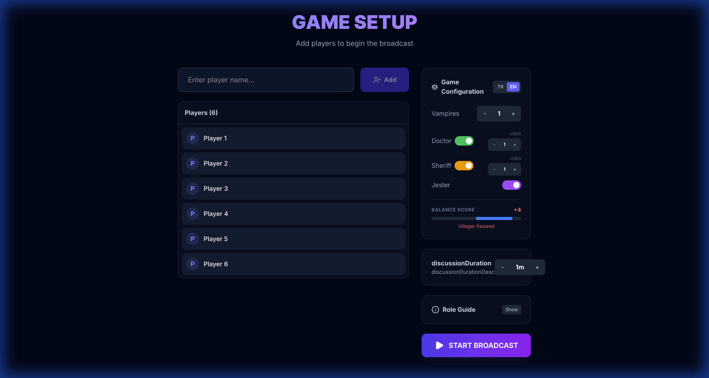

# Vampire Villager (Vampir Köylü)

A modern, web-based implementation of the classic social deduction game "Werewolf" (or "Vampire Villager"), designed for streamers and online communities. This application provides a dedicated **Moderator Dashboard** to manage the game flow and a **Stream View** for the audience.



## 🎮 About the Game

Vampire Villager is a game of deception, deduction, and survival. The village is infiltrated by Vampires who kill at night. The Villagers must work together during the day to identify and vote out the Vampires before they take over the entire village.

## 📜 Game Rules & Phases

The game proceeds in alternating **Night** and **Day** phases:

### 1. Setup
- The Moderator adds player names.
- Roles are distributed randomly based on the game configuration.

### 2. Night Phase 🌑
- **Vampires** wake up and choose a victim to kill.
- **Doctor** wakes up and chooses a player to protect (can be themselves).
- **Sheriff** wakes up and investigates a player to learn their alignment (Good/Evil).
- *Note: The Moderator manages these actions via the Dashboard.*

### 3. Morning Announcement 🌅
- The Moderator reveals the events of the night.
- If the Doctor successfully protected the victim, no one dies.
- If not, the victim is eliminated and revealed.

### 4. Day Phase ☀️
- **Discussion**: Survivors discuss who they suspect.
- **Voting**: Players vote to eliminate a suspect.
- **Defense & Judgment**: The player with the most votes is eliminated (or saved if there's a tie/skip).

### 5. Winning Conditions 🏆
- **Villagers Win**: All Vampires are eliminated.
- **Vampires Win**: Vampires equal or outnumber the Villagers.
- **Jester Wins**: The Jester is voted out by the village.

## 🎭 Roles

| Role | Icon | Alignment | Description |
|------|------|-----------|-------------|
| **Villager** | 🧑‍🌾 | Good | Innocent villager. Goal: Survive and vote out vampires. |
| **Vampire** | 🧛 | Evil | Creature of the night. Goal: Kill villagers and deceive everyone. |
| **Doctor** | 👨‍⚕️ | Good | Can save one person each night from attack. |
| **Sheriff** | 👮 | Good | Can investigate one person each night to reveal their team. |
| **Jester** | 🃏 | Neutral | Wants to be voted out. Wins if executed by the village. |

## 🕹️ How to Play

### For the Moderator
1.  **Add Players**: Enter names in the setup screen (Min 4 players).
2.  **Start Broadcast**: Click to begin the game.
3.  **Manage Phases**: Use the Dashboard to guide the game.
    - Follow the prompts for each role (Vampire, Doctor, Sheriff).
    - Announce results to the players.
    - Manage the timer and voting process.


### For the Stream/Audience
- The **Stream View** shows the current game state, living players, and graveyard.
- It updates automatically as the Moderator progresses the game.


## 🛠️ Installation & Running

This project is built with [React](https://react.dev/) and [Vite](https://vitejs.dev/).

### Prerequisites
- Node.js (v16 or higher)
- npm

### Steps
1.  Clone the repository.
2.  Install dependencies:
    ```bash
    npm install
    ```
3.  Start the development server:
    ```bash
    npm run dev
    ```
4.  Open your browser at `http://localhost:5173`.

## 🌍 Languages
The game currently supports:
- 🇹🇷 Turkish (Default)
- 🇬🇧 English

---
*Built for fun and chaos.*
